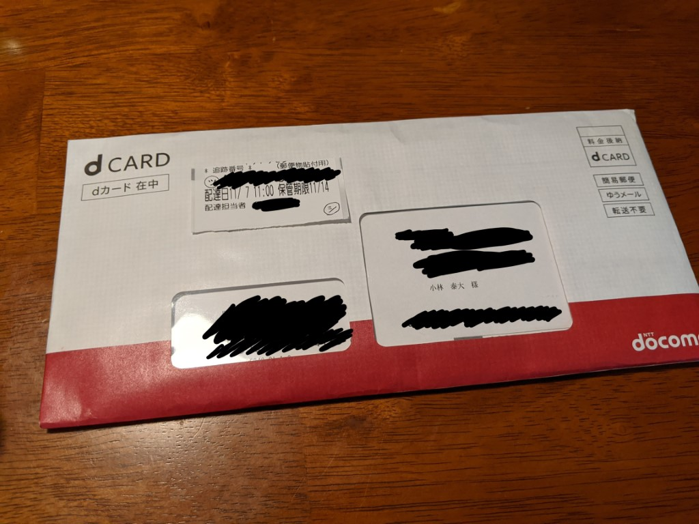

先日、 [dカードが本人確認なく申し込めたとの記事]()
を書いたが、 7 日に簡易書留として到着した（当日は不在だったので実際に受け取ったのは 8 日）。

これが問題の写真。

恐る恐る封筒を開けると、内容物は次の通り。
- カードそのものが貼り付けられた台紙・宛名紙
- Visa のタッチ決済対応カードのご案内
- まだまだあります!! おトクで便利なdカードのつかいかた!!
- d CARD スタートアップガイド
- dカードのはじめかた
- dカードか利用規約（会員規約）

つまり本人確認書類の返送を求められていない、ということになるようだ。

# すなわち
ここまでに私が提出した情報を持って、本人確認は完了しているとのスタンスのようである。

前の記事で書いたような、犯罪収益移転防止法が求める **本人特定事項の確認** のために **「書類」を「定められた方法で確認すること」** が行われていないような気がするのだが……。

# これって結局
ドコモ口座とまるっきり同じことが起きているのではないだろうか。

スクリーンショットを撮っておくべきだったが、私が申し込みにあたって提示した情報は概ね次の通りである。
- 個人の情報（氏名、住所、電話番号など）
- 勤務先の情報（名称、住所、電話番号、職位、従業員規模など）
- 口座振替先に関する情報（地銀ネットワークサービス経由で申し込み）

まさかとは思うが、「Web 口振受付サービスで認証が通ったから本人確認しました」とおっしゃるわけではあるまいな。
結局「その銀行に取引があること」まではわかっても、「画面の前で申し込んだのが本人である」ことは確認できないのだが。

# 考え得るストーリー
最悪のケースは **知らないうちにdカードを契約されてあれもこれも買い物される** ことだろう。

ドコモ口座よりたちが悪いのは、dカードの場合実際に購買した日と引き落とされる日にそれなりに間が空くことだ（締め日と引き落とし日の関係）。ドコモ口座の場合引き落としが即時であって購買の方が後につく。

不正利用防止のためのシステムに検知されることも考えられるが、いきなり多額の決済をしたり、あちこちの加盟店で決済したりしなければある程度回避できるだろう。

# 今後
どうしようかな。問い合わせ窓口にどうなってんの？って投げ込むのもいいけど体力が。

- 本人確認書類の提示を求めなかった理由は何か
- （本人確認書類の提示を求めるケースは何か）
- 犯罪収益移転防止法の求める取引時確認を行ったと考える根拠は何か

この3点くらいは問い合わせるべきだろうか。
